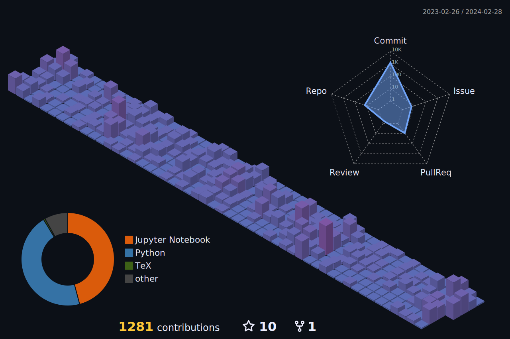

Hi! I'm Anuj.

I'm a second-year astrophysics PhD student at the [Centre for Astrophysics](https://www.unisq.edu.au/research/institutes-centres/iaess/centre-for-astrophysics) at the University of Southern Queensland. 

My research is focused on Asteroseismology, particularly with $\delta$ Scuti stars. I produce theoretical models for these stars to understand how various physical and computational parameters influence their pulsation behaviour. I am into open-source science and automation.

📫 Feel free to drop me an email at anuj.gautam@unisq.edu.au.
    

<!-- 

<b><i>💻 Coding Stats</b></i>

 -->
  
<!-- START_SECTION:waka -->
<!-- END_SECTION:waka -->
  
<!-- 

 -->

<!-- 

 

 --> 

<!-- 

 

 -->

<!--
**gautam-404/gautam-404** is a ✨ _special_ ✨ repository because its `README.md` (this file) appears on your GitHub profile.

Here are some ideas to get you started:

- 🔭 I’m currently working on ...
- 🌱 I’m currently learning ...
- 👯 I’m looking to collaborate on ...
- 🤔 I’m looking for help with ...
- 💬 Ask me about ...
- 📫 How to reach me: ...
- 😄 Pronouns: ...
- ⚡ Fun fact: ... 
-->
